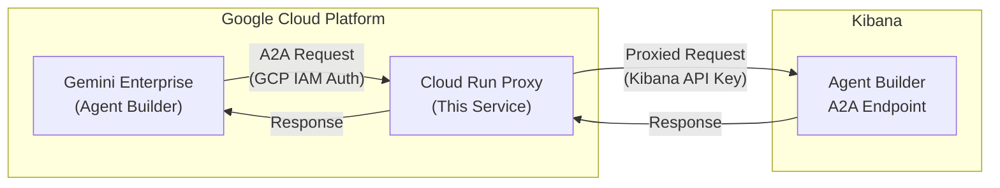

# Elastic A2A Proxy for Gemini Enterprise

A Cloud Run proxy that enables [Gemini Enterprise (Agent Builder)](https://cloud.google.com/products/agent-builder) to communicate with Elastic AI agents via the [A2A protocol](https://google.github.io/A2A/).

## Architecture



## Security Model

| Connection | Authentication |
|------------|----------------|
| Gemini Enterprise → Cloud Run | GCP IAM (Cloud Run Invoker role) |
| Cloud Run → Kibana | Kibana API Key (stored as env var) |

- Cloud Run is deployed with `--no-allow-unauthenticated` — only authorized GCP principals can invoke it
- Kibana API key is injected server-side; never exposed to clients

## Setup

### Prerequisites
- GCP project with Cloud Run enabled
- Elastic Cloud deployment with an AI agent configured
- Kibana API key with appropriate permissions

### Step 1: Deploy the Proxy to Cloud Run

```bash
# Clone this repository
git clone <repo-url> && cd a2a-cloud-run

# Create .env file (see .env.example)
cp .env.example .env
# Edit .env with your values:
#   AGENT_ID=your-elastic-agent-id
#   KBN_URL=https://your-kibana.elastic-cloud.com
#   API_KEY=your-kibana-api-key
#   PROJECT_ID=your-gcp-project
#   SERVICE_NAME=elastic-agent-a2a

# Deploy
./deploy.sh
```

### Step 2: Grant Gemini Enterprise Access

Add the Cloud Run Invoker IAM role to allow Agent Builder to call your proxy:

```bash
gcloud run services add-iam-policy-binding SERVICE_NAME \
  --region=us-central1 \
  --member="serviceAccount:SERVICE_AGENT_EMAIL" \
  --role="roles/run.invoker"
```

See [Google's guide on IAM for Cloud Run agents](https://cloud.google.com/dialogflow/vertex/docs/concept/agents-cloud-run) for details.

### Step 3: Register the Agent in Gemini Enterprise

Register your proxied agent endpoint in Agent Builder using the Cloud Run service URL:

```
https://YOUR-SERVICE-URL/elastic/agent
```

## Endpoints

| Endpoint | Method | Description |
|----------|--------|-------------|
| `/elastic/agent.json` | GET | Agent card (A2A discovery) |
| `/elastic/agent` | POST | Agent invocation (A2A messages) |
| `/healthz` | GET | Health check |

## Configuration Reference

| Variable | Required | Description |
|----------|----------|-------------|
| `AGENT_ID` | Yes | Elastic AI agent ID |
| `KBN_URL` | Yes | Kibana base URL |
| `API_KEY` | Yes | Kibana API key |
| `PROXY_BASE_URL` | Auto | Set automatically by deploy script |
| `TIMEOUT_SECONDS` | No | Request timeout (default: 120) |

## Local Development

```bash
uv sync
cp .env.example .env  # Edit with your values
uv run uvicorn app.main:app --host 0.0.0.0 --port 8080
```
